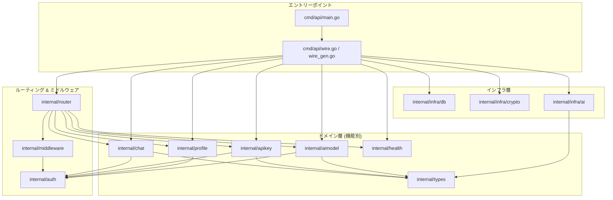
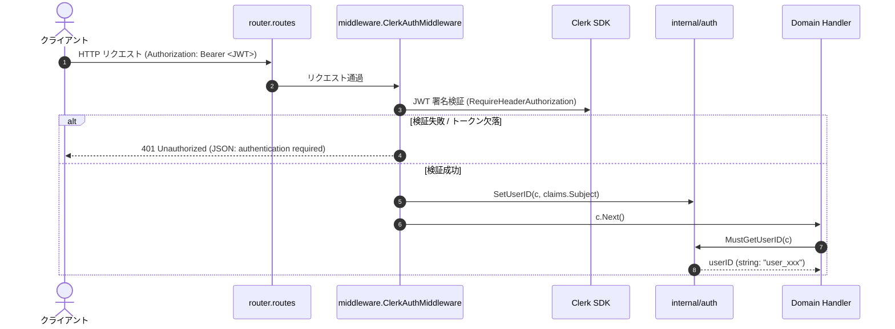
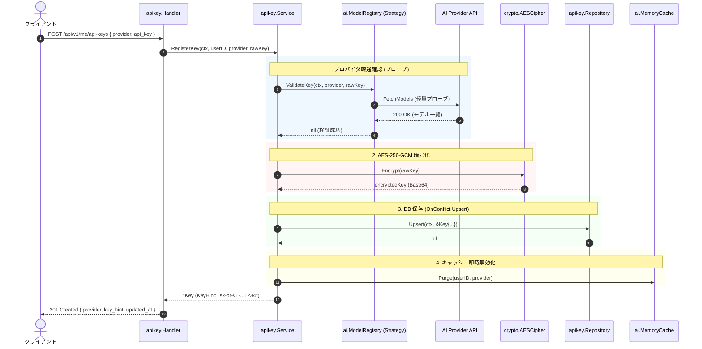
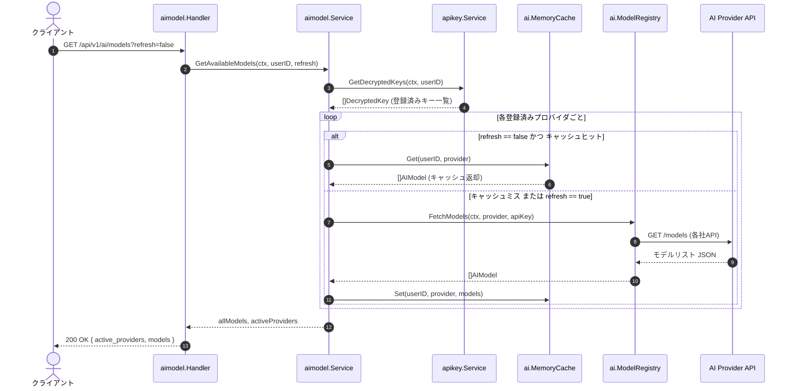
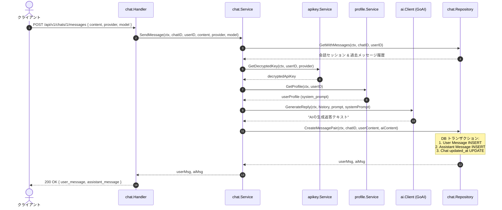
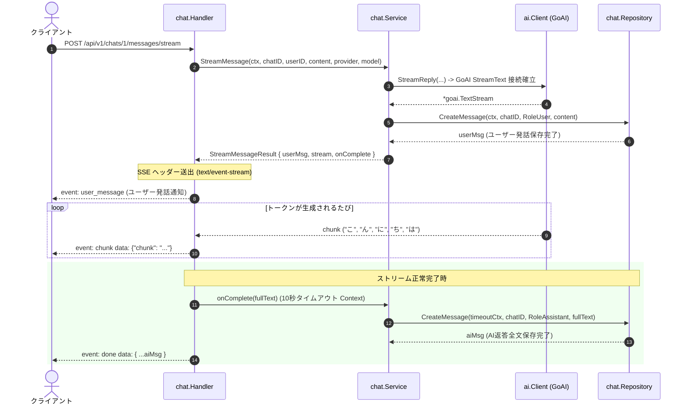
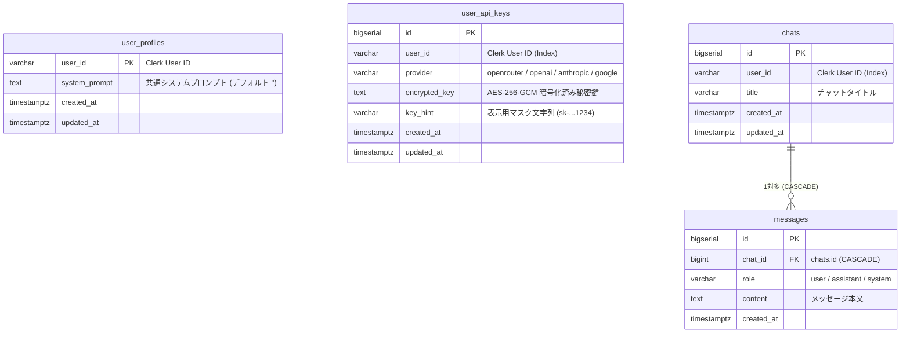

# アーキテクチャ完全解説ガイド (ARCHITECTURE.md)

本書は、本プロジェクト（Go + Gin + Clerk + GORM + GoAI）の **システム構成、依存関係、各レイヤーの役割分担、リクエストの流れ（データフロー）** を余すところなく体系的に解説した完全ドキュメントです。

「水平分割（レイヤード）」から現在の「ドメイン駆動／フィーチャー分割（Package-by-feature）」への移行を経て、**「どこで何をやっているのか」「なぜその構造になっているのか」「誰が誰を呼び出しているのか」** を明確に理解できるように構成されています。

---

## 目次

1. [全体設計思想とアーキテクチャ概要](#1-全体設計思想とアーキテクチャ概要)
   - 1.1. 水平分割から垂直分割（ドメイン別）への移行理由
   - 1.2. 依存関係逆転の原則（DIP）の徹底
   - 1.3. Google Wire によるコンパイル時 DI
2. [全ファイル一覧と役割完全マップ](#2-全ファイル一覧と役割完全マップ)
3. [レイヤーごとの責務と役割分担の原則](#3-レイヤーごとの責務と役割分担の原則)
   - 3.1. Handler（Web 通訳層）
   - 3.2. Service（業務ルール層）
   - 3.3. Repository（データ永続化層）
   - 3.4. Infra（外部技術・低レベル基盤層）
   - 3.5. Auth & Middleware（防腐層 / ACL）
4. [依存関係グラフ（Dependency Graph）](#4-依存関係グラフdependency-graph)
   - 4.1. パッケージ間依存マップ
   - 4.2. インターフェースによる逆転関係（DIP 一覧）
   - 4.3. Wire による依存解決（組み立て順序）
5. [主要リクエストの処理シーケンス（データフロー詳解）](#5-主要リクエストの処理シーケンスデータフロー詳解)
   - 5.1. 認証とコンテキスト伝搬（全リクエスト共通）
   - 5.2. API キー暗号化登録・検証 (`POST /api/v1/me/api-keys`)
   - 5.3. モデル動的取得 & キャッシュ (`GET /api/v1/ai/models`)
   - 5.4. チャットメッセージ送信・一括生成 (`POST /api/v1/chats/:id/messages`)
   - 5.5. リアルタイムストリーミング (SSE) (`POST /api/v1/chats/:id/messages/stream`)
   - 5.6. プロファイル & システムプロンプト設定 (`GET/PUT /api/v1/me`)
6. [データベース設計と永続化戦略](#6-データベース設計と永続化戦略)
   - 6.1. ER 図
   - 6.2. Clerk を SSoT とするマルチテナント分離
7. [機能追加・拡張・テスト実践ガイド](#7-機能追加拡張テスト実践ガイド)
   - 7.1. 新規ドメインを追加する手順
   - 7.2. 新規 AI プロバイダを追加する手順
   - 7.3. 単体テストの作成パターン

---

## 1. 全体設計思想とアーキテクチャ概要

### 1.1. 水平分割から垂直分割（ドメイン別）への移行理由

初期のプロジェクト構成は、以下のような**技術レイヤーごとの水平分割（Package-by-layer）**でした：

```
internal/
  ├── handler/    # 全機能のハンドラーが集約
  ├── service/    # 全機能のビジネスロジックが集約
  ├── model/      # 全機能の GORM モデルが集約
  └── infra/repository/ # 全機能のリポジトリが集約
```

この構成には以下の問題がありました：

1. **変更箇所の分散**: 「チャット機能」に1つの修正を加える際、`handler`, `service`, `model`, `repository` という4つのフォルダを行き来する必要がありました。
2. **過度の密結合**: `service` パッケージ内で、チャット処理と API キー処理、AI クライアント処理が互いに具象型を参照しあい、責任の境界が曖昧になりがちでした。

現在の構成は、**ドメイン（機能）ごとの垂直分割（Package-by-feature）**を採用しています：

```
internal/
  ├── chat/       # チャットに関する Model, Repo, Service, Handler, Wire が凝集
  ├── apikey/     # API キー管理に関する Model, Repo, Service, Handler, Wire が凝集
  ├── profile/    # プロファイル・プロンプトに関する構成要素が凝集
  ├── aimodel/    # モデル一覧取得に関する構成要素が凝集
  ├── health/     # ヘルスチェックに関する構成要素が凝集
  └── infra/      # 共通のインフラ技術（DB, 暗号, GoAI SDK）を集約
```

これにより、**「チャットに関する変更は `internal/chat` の中を見ればすべて完結する」** という高い凝集度（High Cohesion）を実現しています。

---

### 1.2. 依存関係逆転の原則（DIP）の徹底

高レイヤー（ビジネスルール）が低レイヤー（外部 API や DB、暗号化処理）の具象型に直接依存すると、以下の弊害が生じます：

- 外部 API（OpenAI や OpenRouter）がダウンしているとテストが書けない。
- DB や暗号鍵がないとロジックを単体検証できない。

そこで、**呼び出し側（Consumer）が必要とする振る舞いをインターフェースとして宣言**する Go の慣例に従い、依存関係を逆転（Inversion）させています。

```
【旧構成: 具象型への直接依存】
chat.Service ──> *ai.Client (GoAI SDK に直結 / Mock 化不可)
apikey.Service ──> *crypto.AESCipher (暗号具象に直結 / Mock 化不可)

【新構成: インターフェースによる依存逆転】
chat.Service ──> interface ChatClient <── [実装] infra/ai.Client
apikey.Service ──> interface Encryptor <── [実装] infra/crypto.AESCipher
```

---

### 1.3. Google Wire によるコンパイル時 DI

Go にはリフレクション（実行時動的解決）による DI ツールもありますが、本プロジェクトでは Google 公式の **[Google Wire](https://github.com/google/wire)** を採用しています。

- **実行時オーバーヘッドがゼロ**: リフレクションを使わず、コード生成で純粋な Go 関数（[`InitializeApp`](file:///home/naomi/prog/test/study-gin-clerk/cmd/api/wire_gen.go#L25)）を出力します。
- **コンパイル時にエラー検知**: 依存の渡し忘れや型の不一致があれば、ビルド前に即座に失敗します。
- **追跡性**: 誰がどの順序でインスタンス化され、誰に渡されたかが `wire_gen.go` を見れば1行ずつ追うことができます。

---

## 2. 全ファイル一覧と役割完全マップ

プロジェクト内の全ファイルとその責務を以下に網羅します。

```
study-gin-clerk/
│
├── cmd/
│   └── api/
│       ├── main.go               # アプリのエントリポイント。slog 設定、Graceful Shutdown、HTTP サーバ起動
│       ├── wire.go               # Wire Injector 宣言（InitializeApp の設計図）
│       └── wire_gen.go           # Wire が自動生成した依存関係解決コード（手動編集禁止）
│
├── internal/
│   │
│   ├── auth/                     # 【認証ヘルパー】
│   │   ├── context.go            # Gin Context と user_id 文字列の型安全な出し入れ（SetUserID, MustGetUserID）
│   │   └── context_test.go       # context.go の単体テスト
│   │
│   ├── config/                   # 【環境設定】
│   │   ├── env.go                # .env の読み込み・検証・CORS オリジン分離（Config.Load）
│   │   └── env_test.go           # 環境変数読み込み・バリデーションの単体テスト
│   │
│   ├── middleware/               # 【ミドルウェア】
│   │   └── clerk.go              # Clerk Go SDK による JWT 署名検証、防腐層（ACL）としての user_id 抽出
│   │
│   ├── router/                   # 【HTTP ルーティング】
│   │   ├── routes.go             # Gin Engine 構築、CORS ミドルウェア設定、API エンドポイント定義
│   │   └── wire.go               # router.Set (New 関数の Provider 定義)
│   │
│   ├── types/                    # 【共通ドメイン値オブジェクト】
│   │   ├── provider.go           # AI プロバイダ enum（openrouter, openai, anthropic, google）と検証
│   │   ├── provider_test.go      # Provider のパース・バリデーション単体テスト
│   │   └── ai_model.go           # AI モデルメタデータ表現（AIModel DTO 構造体）
│   │
│   ├── health/                   # 【ヘルスチェック機能】
│   │   ├── handler.go            # GET /health（DB 疎通確認 Ping）
│   │   └── wire.go               # health.Set
│   │
│   ├── profile/                  # 【ユーザー設定・プロファイル機能】
│   │   ├── model.go              # GORM モデル Profile (テーブル: user_profiles)
│   │   ├── repository.go         # Profile の Upsert / GetByUserID DB 操作
│   │   ├── service.go            # プロファイル取得・システムプロンプト更新ビジネスルール
│   │   ├── handler.go            # GET /api/v1/me, PUT /api/v1/me/system-prompt
│   │   ├── errors.go             # ErrNotFound 定義
│   │   └── wire.go               # profile.Set
│   │
│   ├── apikey/                   # 【ユーザー独自 AI API キー管理機能】
│   │   ├── model.go              # GORM モデル Key (テーブル: user_api_keys), MaskKey 表示用マスク関数
│   │   ├── repository.go         # Key の Upsert (OnConflict), GetByProvider, List, Delete DB 操作
│   │   ├── service.go            # キー登録・疎通確認・暗号化・復号化ビジネスルール (インターフェース駆動)
│   │   ├── service_test.go       # Mock を用いた apikey.Service の単体テスト
│   │   ├── handler.go            # POST, GET, DELETE /api/v1/me/api-keys
│   │   ├── errors.go             # ErrNotFound, ErrNotRegistered, ErrValidationFailed 定義
│   │   └── wire.go               # apikey.Set (ProvideService によるアダプタ定義)
│   │
│   ├── aimodel/                  # 【AI モデル一覧取得機能】
│   │   ├── service.go            # ユーザー登録キーに基づくモデル動的フェッチ & キャッシュ統合
│   │   ├── service_test.go       # Mock を用いた aimodel.Service の単体テスト
│   │   ├── handler.go            # GET /api/v1/ai/models (?refresh=true)
│   │   └── wire.go               # aimodel.Set
│   │
│   ├── chat/                     # 【チャット・メッセージ機能】
│   │   ├── model.go              # GORM モデル Chat (chats), Message (messages), Role enum
│   │   ├── repository.go         # 会話作成, 一覧, メッセージ履歴取得, アトミック保存 (CreateMessagePair)
│   │   ├── service.go            # 会話準備, 一括返答生成, SSE ストリーミングオーケストレーション
│   │   ├── service_test.go       # Mock を用いた chat.Service の単体テスト
│   │   ├── handler.go            # POST/GET /api/v1/chats, POST messages, POST messages/stream (SSE)
│   │   ├── errors.go             # ErrNotFound, ErrValidationFailed, ErrAIProvider, ErrAPIKeyNotConfigured
│   │   └── wire.go               # chat.Set (ProvideService によるアダプタ定義)
│   │
│   └── infra/                    # 【インフラ層: 外部サービス・低レベル技術の集約】
│       ├── db/
│       │   ├── db.go             # PostgreSQL 接続初期化、GORM 設定、コネクションプール管理、cleanup
│       │   └── wire.go           # db.Set
│       ├── crypto/
│       │   ├── aes.go            # AES-256-GCM 暗号化・復号化、Cipher インターフェース定義
│       │   ├── aes_test.go       # AESCipher 暗号化・復号化単体テスト
│       │   └── wire.go           # crypto.Set (ProvideCipher, wire.Bind)
│       └── ai/
│           ├── client.go         # GoAI SDK クライアント、ChatClient インターフェース定義
│           ├── registry.go       # Strategy パターンによる各社 API モデルフェッチャー (ProviderFetcher)
│           ├── cache.go          # 容量制限・定期パージ付きスレッドセーフ MemoryCache (ModelCacher)
│           └── wire.go           # ai.Set (wire.Bind による各種インターフェース結合)
│
├── migrations/                   # golang-migrate 用 SQL マイグレーションファイル
├── docs/                         # Swagger UI / OpenAPI 2.0 自動生成ファイル (swag init)
├── web/                          # 仮フロントエンド (Nginx, index.html, Clerk JS 連携)
├── compose.yaml                  # Docker Compose 定義
└── Dockerfile                    # API コンテナビルド定義
```

---

## 3. レイヤーごとの責務と役割分担の原則

各レイヤーが担うべき役割と、**「やってはいけないこと（アンチパターン）」**を定義しています。

### 3.1. Handler（Web 通訳層）

- **役割**:
  - HTTP リクエストの受付（JSON バインド、Query パラメータの取得、パスパラメータの数値変換）。
  - Gin Context からの認証済み `user_id` 取得（[`auth.MustGetUserID(c)`](file:///home/naomi/prog/test/study-gin-clerk/internal/auth/context.go#L27)）。
  - Service の呼び出し。
  - HTTP ステータスコード（200, 201, 400, 404, 500 等）およびレスポンス JSON / SSE イベントのフォーマット。
  - Swagger アノテーション（`@Summary`, `@Param`, `@Success` 等）の保持。
- **やってはいけないこと**:
  - ❌ SQL や GORM の直接実行。
  - ❌ 複雑なビジネス判断（例: モデル利用権限の判定や暗号化処理）。
  - ❌ 他ドメインの Service や内部エラー構造体への過度な依存。

### 3.2. Service（業務ルール層）

- **役割**:
  - ドメインの純粋な業務ルールの統括。
  - 必要なデータの組み合わせ（例: チャットセッション所有権の確認 → API キー復号 → プロンプト取得 → AI 返答生成 → アトミック永続化）。
  - コンテキスト（`context.Context`）の伝搬とタイムアウト制御。
  - ビジネス例外のエラーハンドリング（ドメインエラーの返却）。
- **やってはいけないこと**:
  - ❌ `*gin.Context` や `http.ResponseWriter` への依存（Web フレームワーク非依存を徹底）。
  - ❌ 外部インフラの具象型（`*gorm.DB`, `*ai.Client`, `*crypto.AESCipher`）への直接結合（インターフェースを受け取る）。

### 3.3. Repository（データ永続化層）

- **役割**:
  - GORM / SQL を用いたデータベース CRUD 操作。
  - マルチテナント分離のための `WHERE user_id = ?` 条件の強制。
  - トランザクション制御（`tx.Transaction`）によるアトミックなデータ保存（例: `CreateMessagePair`）。
  - GORM の `gorm.ErrRecordNotFound` をドメインの `ErrNotFound` に変換して抽象化。
- **やってはいけないこと**:
  - ❌ ビジネスロジック（例: AI の返答内容の生成や暗号化・復号化）。
  - ❌ HTTP や Gin への依存。

### 3.4. Infra（外部技術・低レベル基盤層）

- **役割**:
  - 外部 SaaS / SDK（GoAI SDK, Clerk, 各社 AI API）や OS リソース（暗号化, DB コネクションプール）との直接の通信。
  - 各社プロバイダの API 仕様（エンドポイント URL、ヘッダー、JSON 形式）の吸収。
- **やってはいけないこと**:
  - ❌ アプリケーションのビジネスフローの決定。

### 3.5. Auth & Middleware（防腐層 / ACL）

- **役割**:
  - **防腐層（Anti-Corruption Layer）**: Clerk Go SDK を [`internal/middleware/clerk.go`](file:///home/naomi/prog/test/study-gin-clerk/internal/middleware/clerk.go) の中に完全に隔離。
  - 認証済みリクエストから `claims.Subject` を取り出し、アプリ内部の共通キーとして [`auth.SetUserID(c, userID)`](file:///home/naomi/prog/test/study-gin-clerk/internal/auth/context.go#L8) にセット。
  - これにより、ハンドラー以降の全コードは Clerk SDK に一切依存せず、純粋な `user_id`（string）だけを扱えば良くなります。

---

## 4. 依存関係グラフ（Dependency Graph）

### 4.1. パッケージ間依存マップ



---

### 4.2. インターフェースによる逆転関係（DIP 一覧）

各サービスが依存しているインターフェースと、それを実際に満たしている具象実装の対応表です。

| 利用側サービス         | 要求するインターフェース | メソッド要件                                                     | 実際の提供元（実装構造体）                                                                            |
| :--------------------- | :----------------------- | :--------------------------------------------------------------- | :---------------------------------------------------------------------------------------------------- |
| **`apikey.Service`**   | `KeyRepository`          | `Upsert`, `GetByProvider`, `ListByUserID`, `DeleteByProvider`    | [`apikey.Repository`](file:///home/naomi/prog/test/study-gin-clerk/internal/apikey/repository.go#L13) |
|                        | `KeyValidator`           | `ValidateKey(ctx, provider, apiKey)`                             | [`ai.ModelRegistry`](file:///home/naomi/prog/test/study-gin-clerk/internal/infra/ai/registry.go#L25)  |
|                        | `CacheInvalidator`       | `Purge(userID, provider)`                                        | [`ai.MemoryCache`](file:///home/naomi/prog/test/study-gin-clerk/internal/infra/ai/cache.go#L25)       |
|                        | `Encryptor`              | `Encrypt(string)`, `Decrypt(string)`                             | [`crypto.AESCipher`](file:///home/naomi/prog/test/study-gin-clerk/internal/infra/crypto/aes.go#L21)   |
| **`chat.Service`**     | `ChatRepository`         | `Create`, `ListByUserID`, `GetWithMessages`, `CreateMessagePair` | [`chat.Repository`](file:///home/naomi/prog/test/study-gin-clerk/internal/chat/repository.go#L11)     |
|                        | `KeyProvider`            | `GetDecryptedKey(ctx, userID, provider)`                         | [`apikey.Service`](file:///home/naomi/prog/test/study-gin-clerk/internal/apikey/service.go#L112)      |
|                        | `ProfileProvider`        | `GetProfile(ctx, userID)`                                        | [`profile.Service`](file:///home/naomi/prog/test/study-gin-clerk/internal/profile/service.go#L17)     |
|                        | `ChatClient`             | `GenerateReply`, `StreamReply`                                   | [`ai.Client`](file:///home/naomi/prog/test/study-gin-clerk/internal/infra/ai/client.go#L44)           |
| **`aimodel.Service`**  | `KeyProvider`            | `GetDecryptedKeys(ctx, userID)`                                  | [`apikey.Service`](file:///home/naomi/prog/test/study-gin-clerk/internal/apikey/service.go#L136)      |
|                        | `ModelFetcher`           | `FetchModels(ctx, provider, apiKey)`                             | [`ai.ModelRegistry`](file:///home/naomi/prog/test/study-gin-clerk/internal/infra/ai/registry.go#L25)  |
|                        | `ModelCache`             | `Get(userID, provider)`, `Set(userID, provider, models)`         | [`ai.MemoryCache`](file:///home/naomi/prog/test/study-gin-clerk/internal/infra/ai/cache.go#L25)       |
| **`ai.ModelRegistry`** | `ProviderFetcher`        | `FetchModels(ctx, apiKey)`, `ValidateKey(ctx, apiKey)`           | `openRouterFetcher`, `openAIFetcher`, `anthropicFetcher`, `googleFetcher`                             |

---

### 4.3. Wire による依存解決（組み立て順序）

サーバー起動時に [`cmd/api/wire_gen.go`](file:///home/naomi/prog/test/study-gin-clerk/cmd/api/wire_gen.go) の `InitializeApp` が実行される際、依存関係グラフの葉（Leaf）から根（Root）へと逆算されてインスタンスが生成されます：

```
[1. インフラ初期化]
  ├── db.NewDB(cfg)                      --> *gorm.DB, cleanup
  ├── ai.NewModelRegistry()              --> *ai.ModelRegistry
  ├── ai.NewMemoryCacheDefault()         --> *ai.MemoryCache, cleanup2
  ├── crypto.ProvideCipher(cfg)          --> *crypto.AESCipher
  └── ai.NewClient(cfg)                  --> *ai.Client

[2. リポジトリ初期化]
  ├── health.NewHandler(gormDB)          --> *health.Handler
  ├── profile.NewRepository(gormDB)      --> *profile.Repository
  ├── apikey.NewRepository(gormDB)       --> *apikey.Repository
  └── chat.NewRepository(gormDB)         --> *chat.Repository

[3. サービス初期化 (インターフェース注入)]
  ├── profile.NewService(profileRepo)    --> *profile.Service
  ├── apikey.ProvideService(...)         --> *apikey.Service
  ├── aimodel.ProvideService(...)        --> *aimodel.Service
  └── chat.ProvideService(...)           --> *chat.Service

[4. ハンドラー初期化]
  ├── profile.NewHandler(...)            --> *profile.Handler
  ├── apikey.NewHandler(...)             --> *apikey.Handler
  ├── aimodel.NewHandler(...)            --> *aimodel.Handler
  └── chat.NewHandler(...)               --> *chat.Handler

[5. ルーター構築]
  └── router.New(Dependencies{...})      --> *gin.Engine
```

---

## 5. 主要リクエストの処理シーケンス（データフロー詳解）

### 5.1. 認証とコンテキスト伝搬（全リクエスト共通）



---

### 5.2. API キー暗号化登録・検証 (`POST /api/v1/me/api-keys`)

ユーザーが独自の API キー（例: OpenRouter）を登録する際の流れです。



---

### 5.3. モデル動的取得 & キャッシュ (`GET /api/v1/ai/models`)

ユーザーが登録した全プロバイダのモデルを15分間インメモリキャッシュ付きで取得します。



---

### 5.4. チャットメッセージ送信・一括生成 (`POST /api/v1/chats/:id/messages`)

一括 JSON モードでの会話送信フローです。AI 生成が完了した後に、ユーザーメッセージと AI 返答がアトミック（単一トランザクション）に永続化されます。



---

### 5.5. リアルタイムストリーミング (SSE) (`POST /api/v1/chats/:id/messages/stream`)

Server-Sent Events (SSE) を用いて、生成されたトークンを 1 文字ずつリアルタイムにブラウザへプッシュ送信します。



---

### 5.6. プロファイル & システムプロンプト設定 (`GET/PUT /api/v1/me`)

- ユーザーごとに 1 つの共通システムプロンプト（`system_prompt`）を保持します。
- プロンプトを変更すると、過去のすべてのチャットセッションに対しても、次回の送信時から最新のシステムプロンプトが動的適用されます。

---

## 6. データベース設計と永続化戦略

### 6.1. ER 図



### 6.2. Clerk を SSoT とするマルチテナント分離

- **`users` テーブルが存在しない理由**:
  ユーザーのアカウント情報（メールアドレス、氏名、パスワード、認証ステータス）はすべて **Clerk** を **SSoT（信頼できる唯一の情報源）** としています。Webhook でローカル DB にユーザーを二重管理する構成を排除することで、同期遅延や不整合リスクをゼロにしています。
- **マルチテナント安全性の担保**:
  すべてのクエリは `WHERE user_id = ?`（または `Preload` 結合時の所有権確認）を必須としており、他ユーザーのチャットや API キーへのアクセスは完全に遮断されています。

---

## 7. 機能追加・拡張・テスト実践ガイド

### 7.1. 新規ドメインを追加する手順

例として、利用制限を管理する `internal/quota` ドメインを新設する場合の標準ステップです：

1. **パッケージとモデル・インターフェース作成** (`internal/quota/`):
   - `model.go`: GORM 構造体
   - `repository.go`: DB 操作
   - `service.go`: 業務ロジック（インターフェースを受け取る）
   - `handler.go`: HTTP ハンドラー
2. **Wire ProviderSet の定義** (`internal/quota/wire.go`):

   ```go
   package quota
   import "github.com/google/wire"

   var Set = wire.NewSet(
       NewRepository,
       NewService,
       NewHandler,
   )
   ```

3. **ルーティングと Injector への登録**:
   - `internal/router/routes.go`: `Dependencies` 構造体に `QuotaHandler` を追加し、ルートをバインド。
   - `cmd/api/wire.go`: `wire.Build` に `quota.Set` を追加。
4. **Wire コードの生成 (コンテナ内実行)**:
   ```bash
   docker compose exec api wire gen ./cmd/api
   ```

---

### 7.2. 新規 AI プロバイダを追加する手順

例として、将来新しいプロバイダ（例: `Groq`）を追加する場合：

1. **`internal/types/provider.go` に追加**:
   ```go
   const ProviderGroq Provider = "groq"
   ```
2. **`internal/infra/ai/registry.go` に Fetcher 実装を追加**:
   ```go
   type groqFetcher struct { httpClient *http.Client }
   func (f *groqFetcher) FetchModels(...) ([]types.AIModel, error) { ... }
   func (f *groqFetcher) ValidateKey(...) error { ... }
   ```
   `NewModelRegistry` の `fetchers` マップに `types.ProviderGroq: newGroqFetcher(httpClient)` を登録するだけで、Service や Handler を一切変更することなく自動的にモデル発見・キー疎通確認が有効化されます（Strategy パターン）。
3. **`internal/infra/ai/client.go` の `CreateModel` に SDK 呼び出しを追加**。

---

### 7.3. 単体テストの作成パターン

インターフェース駆動になっているため、モックを作成して DB や外部 API なしで高速な単体テストが書けます。

```go
// モック作成例 (internal/chat/service_test.go より)
type mockChatClient struct {
    replyText string
}
func (m *mockChatClient) GenerateReply(...) (string, error) {
    return m.replyText, nil
}
func (m *mockChatClient) StreamReply(...) (*goai.TextStream, error) {
    return nil, nil
}

func TestSendMessage(t *testing.T) {
    svc := NewService(mockRepo, mockKeyProvider, &mockChatClient{replyText: "OK"}, mockProfile)
    // 外部通信なしでビジネスロジックを100%検証可能
}
```

コンテナ内でテストを実行するコマンド：

```bash
docker compose exec api go test -v -count=1 ./...
```
