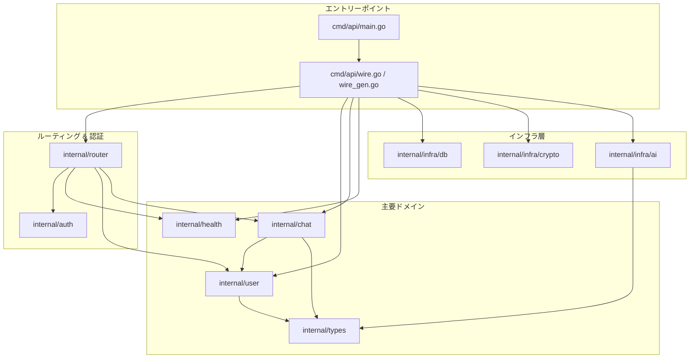
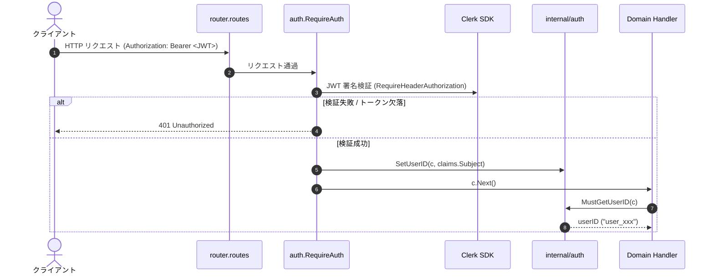
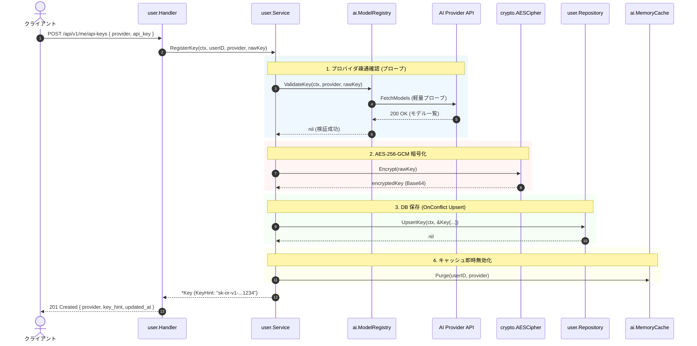
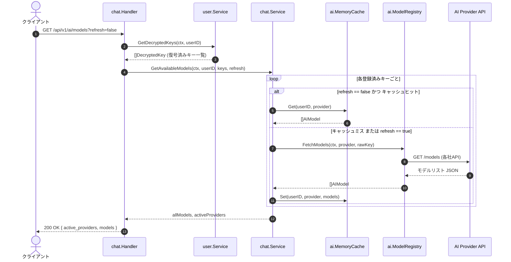
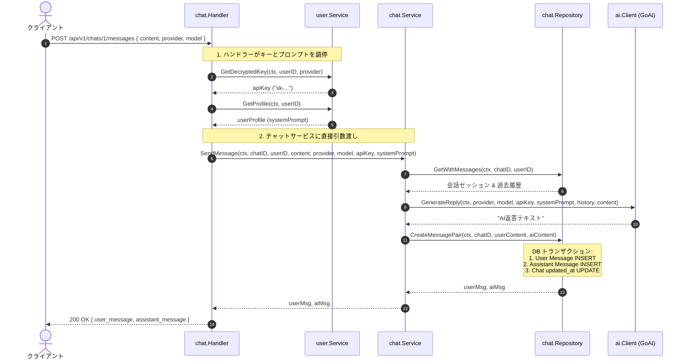
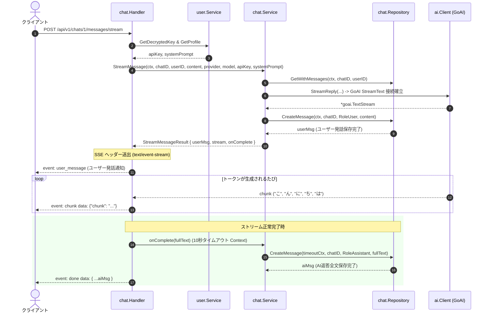
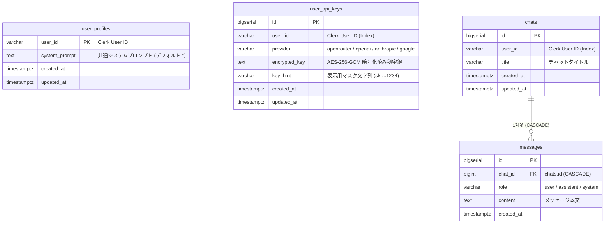

# アーキテクチャ完全解説ガイド (ARCHITECTURE.md)

本書は、本プロジェクト（Go + Gin + Clerk + GORM + GoAI）の **システム構成、依存関係、各レイヤーの役割分担、リクエストの流れ（データフロー）** を余すところなく体系的に解説した完全ドキュメントです。

過剰な細分化（7〜8パッケージへの断片化）を見直し、本プロダクトの規模と凝集度に合わせて**「5つの主要ドメイン＋インフラ」**へと統合・最適化されています。

---

## 目次

1. [全体設計思想とアーキテクチャ概要](#1-全体設計思想とアーキテクチャ概要)
   - 1.1. ドメイン集約と役割の明確化（5ドメイン構成）
   - 1.2. サービス間結合の完全排除（アプローチA: ハンドラー調停と直接引数渡し）
   - 1.3. 依存関係逆転の原則（DIP）の徹底
   - 1.4. Google Wire によるコンパイル時 DI
2. [全ファイル一覧と役割完全マップ](#2-全ファイル一覧と役割完全マップ)
3. [レイヤーごとの責務と役割分担の原則](#3-レイヤーごとの責務と役割分担の原則)
   - 3.1. Handler（Web 通訳 & ユースケース調停層）
   - 3.2. Service（純粋な業務ルール層）
   - 3.3. Repository（データ永続化層）
   - 3.4. Infra（外部技術・低レベル基盤層）
   - 3.5. Auth（認証基盤 & 防腐層 / ACL）
4. [依存関係グラフ（Dependency Graph）](#4-依存関係グラフdependency-graph)
   - 4.1. パッケージ間依存マップ
   - 4.2. インターフェースによる逆転関係（DIP 一覧）
   - 4.3. Wire による依存解決（組み立て順序）
5. [主要リクエストの処理シーケンス（データフロー詳解）](#5-主要リクエストの処理シーケンスデータフロー詳解)
   - 5.1. 認証とコンテキスト伝搬（全リクエスト共通）
   - 5.2. API キー暗号化登録・検証 (`POST /api/v1/me/api-keys`)
   - 5.3. モデル動的取得 & キャッシュ (`GET /api/v1/ai/models`)
   - 5.4. チャットメッセージ送信・一括生成 (`POST /api/v1/chats/:id/messages`)
   - 5.5. リアルタイムストリーミング (SSE) (`POST /api/v1/chats/:id/messages/stream`)
   - 5.6. プロファイル & システムプロンプト設定 (`GET/PUT /api/v1/me`)
6. [データベース設計と永続化戦略](#6-データベース設計と永続化戦略)
   - 6.1. ER 図
   - 6.2. Clerk を SSoT とするマルチテナント分離
7. [機能追加・拡張・テスト実践ガイド](#7-機能追加拡張テスト実践ガイド)
   - 7.1. 新規機能・ドメインを追加する手順
   - 7.2. 新規 AI プロバイダを追加する手順
   - 7.3. 単体テストの作成パターン

---

## 1. 全体設計思想とアーキテクチャ概要

### 1.1. ドメイン集約と役割の明確化（5ドメイン構成）

以前の構成では、1ファイルしかない機能（`profile` や `aimodel`、`apikey`、`middleware`）が細かく別パッケージに分断され、不要なインターフェース（`KeyProvider` や `ProfileProvider`）が量産されていました。

現在は、自然な境界と責務に基づき、以下の **5つの凝集したパッケージ** に統合・整理されています：

```
internal/
  ├── auth/       # Clerk JWT 認証ミドルウェア (RequireAuth) と Gin Context 操作
  ├── user/       # ユーザー設定（プロファイル、共通システムプロンプト、暗号化 API キー管理）
  ├── chat/       # 会話・メッセージ履歴・リアルタイム SSE ストリーミング・利用可能モデル一覧
  ├── health/     # サーバーおよび DB 稼働状態確認 (Ping)
  ├── types/      # プロバイダ enum や AIModel DTO などの共有値オブジェクト
  └── infra/      # DB (GORM), 暗号化 (AES-256-GCM), AI クライアント (GoAI)
```

- **`internal/user`**: 「ユーザーに関する永続情報（プロファイル、システムプロンプト、各社 API キー）」を一箇所で集約管理。
- **`internal/chat`**: 「AI との会話（チャット作成、メッセージ保存、GoAI 生成/ストリーミング、モデル一覧）」を網羅。
- **`internal/auth`**: 認証ミドルウェアとユーザーID抽出を1つのパッケージに凝集（`middleware/` を廃止）。

---

### 1.2. サービス間結合の完全排除（アプローチA: ハンドラー調停と直接引数渡し）

本設計の最大の特徴は、**「サービスが他のサービスを呼び出さない（サービス間ゼロ結合）」**です。

```
【旧アプローチ: サービス間依存 / 過剰なプロバイダIF】
chat.Handler ──> chat.Service ──[KeyProvider]──> user.Service
                             ──[ProfileProvider]──> user.Service
（chat.Service が user のインターフェースを知らなければならず、テスト時に多数のモックが必要）

【新アプローチ: アプローチA（ハンドラー調停 & 直接引数渡し）】
chat.Handler ──> user.Service.GetDecryptedKey(...)   (apiKey 取得)
             ──> user.Service.GetProfile(...)        (systemPrompt 取得)
             ──> chat.Service.SendMessage(..., apiKey, systemPrompt)
```

- **なぜこの設計が良いのか？**:
  1. **`chat.Service` の純粋化**: チャットサービスは「メッセージ、プロバイダ、モデル、APIキー、プロンプト」を直接引数として受け取り、会話を実行して保存するだけの**純粋なドメイン機能**になります。
  2. **テストの劇的な簡素化**: `chat.Service` のテストに `mockKeyProvider` や `mockProfileProvider` を作成する必要がなく、単に文字列として引数を渡すだけで検証できます。
  3. **循環依存の根絶**: サービス同士がお互いを参照しないため、Go で頻発するパッケージ循環参照（import cycle）の恐れが原理的にゼロになります。

---

### 1.3. 依存関係逆転の原則（DIP）の徹底

高レイヤー（業務ルール）が低レイヤー（外部 API や DB、暗号化処理）の具象型に直接依存しないよう、**呼び出し側（Consumer）が必要とする振る舞いをインターフェースとして宣言**しています。

```
chat.Service ──> interface ChatClient     <── [実装] infra/ai.Client
chat.Service ──> interface ChatRepository <── [実装] chat.Repository
user.Service ──> interface KeyValidator   <── [実装] infra/ai.ModelRegistry
user.Service ──> interface Encryptor      <── [実装] infra/crypto.AESCipher
user.Service ──> interface UserRepository <── [実装] user.Repository
```

---

### 1.4. Google Wire によるコンパイル時 DI

Google 公式の **[Google Wire](https://github.com/google/wire)** を採用しています。

- **実行時オーバーヘッドがゼロ**: リフレクションを使わず、コード生成で純粋な Go 関数（[`InitializeApp`](file:///home/naomi/prog/test/study-gin-clerk/cmd/api/wire_gen.go#L23)）を出力します。
- **コンパイル時にエラー検知**: 依存の渡し忘れや型の不一致があれば、ビルド前に即座に失敗します。
- **追跡性**: 誰がどの順序でインスタンス化され、誰に渡されたかが `wire_gen.go` を見れば1行ずつ追うことができます。

---

## 2. 全ファイル一覧と役割完全マップ

プロジェクト内の全ファイルとその責務を以下に網羅します。

```
study-gin-clerk/
│
├── cmd/
│   └── api/
│       ├── main.go               # アプリのエントリポイント。slog 設定、Graceful Shutdown、HTTP サーバ起動
│       ├── wire.go               # Wire Injector 宣言（InitializeApp の設計図）
│       └── wire_gen.go           # Wire が自動生成した依存関係解決コード（手動編集禁止）
│
├── internal/
│   │
│   ├── auth/                     # 【認証基盤 & ミドルウェア】
│   │   ├── context.go            # Gin Context と user_id 文字列の型安全な出し入れ（SetUserID, MustGetUserID）
│   │   ├── context_test.go       # context.go の単体テスト
│   │   └── middleware.go         # Clerk Go SDK による JWT 署名検証、防腐層 (ACL) としての user_id 抽出 (RequireAuth)
│   │
│   ├── config/                   # 【環境設定】
│   │   ├── env.go                # .env の読み込み・検証・CORS オリジン分離（Config.Load）
│   │   └── env_test.go           # 環境変数読み込み・バリデーションの単体テスト
│   │
│   ├── router/                   # 【HTTP ルーティング】
│   │   ├── routes.go             # Gin Engine 構築、CORS ミドルウェア設定、API エンドポイント定義
│   │   └── wire.go               # router.Set (Dependencies の Provider 定義)
│   │
│   ├── types/                    # 【共通ドメイン値オブジェクト】
│   │   ├── provider.go           # AI プロバイダ enum（openrouter, openai, anthropic, google）と検証
│   │   ├── provider_test.go      # Provider のパース・バリデーション単体テスト
│   │   └── ai_model.go           # AI モデルメタデータ表現（AIModel DTO 構造体）
│   │
│   ├── health/                   # 【ヘルスチェック機能】
│   │   ├── handler.go            # GET /health（DB 疎通確認 Ping）
│   │   └── wire.go               # health.Set
│   │
│   ├── user/                     # 【ユーザー設定 & APIキー管理ドメイン】
│   │   ├── model.go              # Profile (user_profiles), Key (user_api_keys), MaskKey マスク関数
│   │   ├── repository.go         # Profile & Key の GORM データベース操作 (OnConflict Upsert 対応)
│   │   ├── service.go            # プロファイル取得/更新、キー疎通検証・AES暗号化・復号化
│   │   ├── service_test.go       # Mock を用いた user.Service の単体テスト
│   │   ├── handler.go            # GET/PUT /api/v1/me, POST/GET/DELETE /api/v1/me/api-keys
│   │   ├── errors.go             # ErrNotFound, ErrValidationFailed, ErrNotRegistered
│   │   └── wire.go               # user.Set
│   │
│   ├── chat/                     # 【チャット & AI 返答・モデル一覧ドメイン】
│   │   ├── model.go              # GORM モデル Chat (chats), Message (messages), Role enum
│   │   ├── repository.go         # 会話作成, 一覧, メッセージ履歴取得, アトミック保存 (CreateMessagePair)
│   │   ├── service.go            # 会話準備, 一括返答生成, SSE ストリーミング, モデル動的フェッチ & キャッシュ
│   │   ├── service_test.go       # Mock を用いた chat.Service の単体テスト
│   │   ├── handler.go            # POST/GET /api/v1/chats, messages, messages/stream, GET /api/v1/ai/models
│   │   ├── errors.go             # ErrNotFound, ErrValidationFailed, ErrAIProvider, ErrAPIKeyNotConfigured
│   │   └── wire.go               # chat.Set
│   │
│   └── infra/                    # 【インフラ層: 外部サービス・低レベル技術の集約】
│       ├── db/
│       │   ├── db.go             # PostgreSQL 接続初期化、GORM 設定、コネクションプール管理、cleanup
│       │   └── wire.go           # db.Set
│       ├── crypto/
│       │   ├── aes.go            # AES-256-GCM 暗号化・復号化、Cipher インターフェース定義
│       │   ├── aes_test.go       # AESCipher 暗号化・復号化単体テスト
│       │   └── wire.go           # crypto.Set (ProvideCipher, wire.Bind)
│       └── ai/
│           ├── client.go         # GoAI SDK クライアント、ChatClient インターフェース定義
│           ├── registry.go       # Strategy パターンによる各社 API モデルフェッチャー (ProviderFetcher)
│           ├── cache.go          # 容量制限・定期パージ付きスレッドセーフ MemoryCache (ModelCacher)
│           └── wire.go           # ai.Set (wire.Bind による各種インターフェース結合)
│
├── migrations/                   # golang-migrate 用 SQL マイグレーションファイル
├── docs/                         # Swagger UI / OpenAPI 2.0 自動生成ファイル (swag init)
├── web/                          # 仮フロントエンド (Nginx, index.html, Clerk JS 連携)
├── compose.yaml                  # Docker Compose 定義
└── Dockerfile                    # API コンテナビルド定義
```

---

## 3. レイヤーごとの責務と役割分担の原則

### 3.1. Handler（Web 通訳 & ユースケース調停層）

- **役割**:
  - HTTP リクエストの受付（JSON バインド、Query パラメータの取得、パスパラメータの数値変換）。
  - Gin Context からの認証済み `user_id` 取得（[`auth.MustGetUserID(c)`](file:///home/naomi/prog/test/study-gin-clerk/internal/auth/context.go#L28)）。
  - **ユースケースの調停（Orchestration）**: 例えば `chat.Handler` は、ユーザーの API キーとプロンプトを `user.Service` から取得し、それを `chat.Service` に引数として渡して処理を委譲します。
  - HTTP ステータスコード（200, 201, 400, 404, 500 等）およびレスポンス JSON / SSE イベントの送出。
  - Swagger アノテーション（`@Summary`, `@Param`, `@Success` 等）の保持。
- **やってはいけないこと**:
  - ❌ SQL や GORM の直接実行。
  - ❌ 暗号化のアルゴリズムや AI プロバイダの通信詳細の決定。

### 3.2. Service（業務ルール層）

- **役割**:
  - ドメインの純粋な業務ルールの統括。
  - コンテキスト（`context.Context`）の伝搬とタイムアウト制御。
  - ビジネス例外のエラーハンドリング（ドメインエラーの返却）。
- **やってはいけないこと**:
  - ❌ `*gin.Context` や `http.ResponseWriter` への依存（Web フレームワーク非依存を徹底）。
  - ❌ 他の Service パッケージへの直接依存（引数で受け取るか、インターフェース化する）。
  - ❌ 外部インフラの具象型（`*gorm.DB`, `*ai.Client`, `*crypto.AESCipher`）への直接結合。

### 3.3. Repository（データ永続化層）

- **役割**:
  - GORM / SQL を用いたデータベース CRUD 操作。
  - マルチテナント分離のための `WHERE user_id = ?` 条件の強制。
  - トランザクション制御によるアトミックなデータ保存（例: `CreateMessagePair`）。
  - GORM の `gorm.ErrRecordNotFound` をドメインの `ErrNotFound` に変換して抽象化。
- **やってはいけないこと**:
  - ❌ ビジネスロジック（例: AI の返答内容の生成や暗号化・復号化）。
  - ❌ HTTP や Gin への依存。

### 3.4. Infra（外部技術・低レベル基盤層）

- **役割**:
  - 外部 SaaS / SDK（GoAI SDK, Clerk, 各社 AI API）や OS リソース（暗号化, DB コネクションプール）との直接の通信。
  - 各社プロバイダの API 仕様（エンドポイント URL、ヘッダー、JSON 形式）の吸収。
- **やってはいけないこと**:
  - ❌ アプリケーションのビジネスフローの決定。

### 3.5. Auth（認証基盤 & 防腐層 / ACL）

- **役割**:
  - Clerk Go SDK による JWT 署名検証（`auth.RequireAuth()`）。
  - 認証済みリクエストから `claims.Subject` を取り出し、アプリ内部の共通コンテキストとして [`auth.SetUserID(c, userID)`](file:///home/naomi/prog/test/study-gin-clerk/internal/auth/context.go#L8) にセット。
  - これにより、ハンドラー以降の全コードは Clerk SDK に一切依存せず、純粋な `user_id`（string）だけを扱えば良くなります。

---

## 4. 依存関係グラフ（Dependency Graph）

### 4.1. パッケージ間依存マップ



> [!NOTE]
> `internal/user` は `internal/chat` を一切インポートしません。`internal/chat/handler.go` が `*user.Service` を保持して呼び出しを調停するため、循環依存は完全に排除されています。

---

### 4.2. インターフェースによる逆転関係（DIP 一覧）

| 利用側サービス         | 要求するインターフェース | メソッド要件                                                     | 実際の提供元（実装構造体）                                                                           |
| :--------------------- | :----------------------- | :--------------------------------------------------------------- | :--------------------------------------------------------------------------------------------------- |
| **`user.Service`**     | `UserRepository`         | `GetProfile`, `UpsertProfile`, `UpsertKey`, `GetKeyByProvider`   | [`user.Repository`](file:///home/naomi/prog/test/study-gin-clerk/internal/user/repository.go#L13)    |
|                        | `KeyValidator`           | `ValidateKey(ctx, provider, apiKey)`                             | [`ai.ModelRegistry`](file:///home/naomi/prog/test/study-gin-clerk/internal/infra/ai/registry.go#L29) |
|                        | `CacheInvalidator`       | `Purge(userID, provider)`                                        | [`ai.MemoryCache`](file:///home/naomi/prog/test/study-gin-clerk/internal/infra/ai/cache.go#L27)      |
|                        | `Encryptor`              | `Encrypt(string)`, `Decrypt(string)`                             | [`crypto.AESCipher`](file:///home/naomi/prog/test/study-gin-clerk/internal/infra/crypto/aes.go#L21)  |
| **`chat.Service`**     | `ChatRepository`         | `Create`, `ListByUserID`, `GetWithMessages`, `CreateMessagePair` | [`chat.Repository`](file:///home/naomi/prog/test/study-gin-clerk/internal/chat/repository.go#L11)    |
|                        | `ChatClient`             | `GenerateReply`, `StreamReply`                                   | [`ai.Client`](file:///home/naomi/prog/test/study-gin-clerk/internal/infra/ai/client.go#L49)          |
|                        | `ModelFetcher`           | `FetchModels(ctx, provider, apiKey)`                             | [`ai.ModelRegistry`](file:///home/naomi/prog/test/study-gin-clerk/internal/infra/ai/registry.go#L29) |
|                        | `ModelCache`             | `Get(userID, provider)`, `Set(userID, provider, models)`         | [`ai.MemoryCache`](file:///home/naomi/prog/test/study-gin-clerk/internal/infra/ai/cache.go#L27)      |
| **`ai.ModelRegistry`** | `ProviderFetcher`        | `FetchModels(ctx, apiKey)`, `ValidateKey(ctx, apiKey)`           | `openRouterFetcher`, `openAIFetcher`, `anthropicFetcher`, `googleFetcher`                            |

---

### 4.3. Wire による依存解決（組み立て順序）

[`cmd/api/wire_gen.go`](file:///home/naomi/prog/test/study-gin-clerk/cmd/api/wire_gen.go) の `InitializeApp` は以下の順序で依存を解決します：

```
[1. インフラ層の初期化]
  ├── db.NewDB(cfg)                      --> *gorm.DB, cleanup
  ├── health.NewHandler(gormDB)          --> *health.Handler
  ├── ai.NewModelRegistry()              --> *ai.ModelRegistry
  ├── ai.NewMemoryCacheDefault()         --> *ai.MemoryCache, cleanup2
  ├── crypto.ProvideCipher(cfg)          --> *crypto.AESCipher
  └── ai.NewClient(cfg)                  --> *ai.Client

[2. ユーザー領域の初期化]
  ├── user.NewRepository(gormDB)         --> *user.Repository
  ├── user.ProvideService(...)           --> *user.Service
  └── user.NewHandler(userService)       --> *user.Handler

[3. チャット領域の初期化]
  ├── chat.NewRepository(gormDB)         --> *chat.Repository
  ├── chat.ProvideService(...)           --> *chat.Service
  └── chat.NewHandler(chatSvc, userSvc)  --> *chat.Handler

[4. ルーター構築]
  └── router.New(Dependencies{...})      --> *gin.Engine
```

---

## 5. 主要リクエストの処理シーケンス（データフロー詳解）

### 5.1. 認証とコンテキスト伝搬（全リクエスト共通）



---

### 5.2. API キー暗号化登録・検証 (`POST /api/v1/me/api-keys`)



---

### 5.3. モデル動的取得 & キャッシュ (`GET /api/v1/ai/models`)



---

### 5.4. チャットメッセージ送信・一括生成 (`POST /api/v1/chats/:id/messages`)



---

### 5.5. リアルタイムストリーミング (SSE) (`POST /api/v1/chats/:id/messages/stream`)



---

## 6. データベース設計と永続化戦略

### 6.1. ER 図



### 6.2. Clerk を SSoT とするマルチテナント分離

- **`users` テーブルが存在しない理由**:
  ユーザーのアカウント情報（メールアドレス、氏名、パスワード、認証ステータス）はすべて **Clerk** を **SSoT（信頼できる唯一の情報源）** としています。Webhook でローカル DB にユーザーを二重管理する構成を排除することで、同期遅延や不整合リスクをゼロにしています。
- **マルチテナント安全性の担保**:
  すべてのクエリは `WHERE user_id = ?`（または所有権確認）を必須としており、他ユーザーのチャットや API キーへのアクセスは完全に遮断されています。

---

## 7. 機能追加・拡張・テスト実践ガイド

### 7.1. 新規機能・ドメインを追加する手順

例として、利用制限を管理する `internal/quota` ドメインを新設する場合の標準ステップです：

1. **パッケージ作成** (`internal/quota/`):
   - `model.go`: GORM 構造体
   - `repository.go`: DB 操作
   - `service.go`: 業務ロジック
   - `handler.go`: HTTP ハンドラー
   - `wire.go`: `var Set = wire.NewSet(NewRepository, NewService, NewHandler)`
2. **ルーティングと Injector への登録**:
   - `internal/router/routes.go`: `Dependencies` 構造体に `QuotaHandler` を追加し、ルートをバインド。
   - `cmd/api/wire.go`: `wire.Build` に `quota.Set` を追加。
3. **Wire コードの生成 (コンテナ内実行)**:
   ```bash
   docker compose exec api wire gen ./cmd/api
   ```

---

### 7.2. 新規 AI プロバイダを追加する手順

例として、新しいプロバイダ（例: `Groq`）を追加する場合：

1. **`internal/types/provider.go` に追加**:
   ```go
   const ProviderGroq Provider = "groq"
   ```
2. **`internal/infra/ai/registry.go` に Fetcher 実装を追加**:
   ```go
   type groqFetcher struct { httpClient *http.Client }
   func (f *groqFetcher) FetchModels(...) ([]types.AIModel, error) { ... }
   func (f *groqFetcher) ValidateKey(...) error { ... }
   ```
   `NewModelRegistry` の `fetchers` マップに `types.ProviderGroq: newGroqFetcher(httpClient)` を登録するだけで、Service や Handler を一切変更することなく自動的にモデル発見・キー疎通確認が有効化されます（Strategy パターン）。
3. **`internal/infra/ai/client.go` の `CreateModel` に SDK 呼び出しを追加**。

---

### 7.3. 単体テストの作成パターン

インターフェース駆動かつサービス間ゼロ結合になっているため、複雑な依存関係のモックを用意することなく単体テストが書けます。

```go
// モック作成例 (internal/chat/service_test.go より)
type mockChatClient struct {
    replyText string
}
func (m *mockChatClient) GenerateReply(...) (string, error) {
    return m.replyText, nil
}
func (m *mockChatClient) StreamReply(...) (*goai.TextStream, error) {
    return nil, nil
}

func TestSendMessage(t *testing.T) {
    svc := NewService(mockRepo, &mockChatClient{replyText: "OK"}, nil, nil)
    // 外部通信なし・KeyProviderモックなしで直接引数渡しで100%検証可能
    userMsg, aiMsg, err := svc.SendMessage(ctx, 1, "user_1", "Hello", types.ProviderOpenRouter, "model", "test-key", "prompt")
}
```

コンテナ内でテストを実行するコマンド：

```bash
docker compose exec api go test -v -count=1 ./...
```
