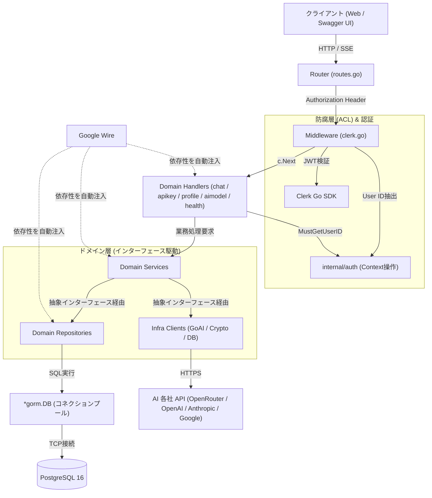

# Go + Gin + Clerk 認証 & AI チャット基盤 API

本プロジェクトは、**Go (Gin)** と **Clerk** による認証基盤の上に、**GORM (PostgreSQL)** および **GoAI (マルチプロバイダ LLM: OpenRouter, OpenAI, Claude, Gemini)** を統合した「AI チャットアプリケーション」のバックエンド API サーバーです。

実務で耐えうる **「ドメイン凝集」「疎結合（DIP）」「高テスタビリティ」「コンパイル時 DI（Google Wire）」** を備えたアーキテクチャを採用しています。

---

## 目次

- [1. 技術スタック](#1-技術スタック)
- [2. システムアーキテクチャ & データフロー](#2-システムアーキテクチャ--データフロー)
- [3. ディレクトリ構成](#3-ディレクトリ構成)
- [4. これまでの設計判断と進化のプロセス（ADR）](#4-これまでの設計判断と進化のプロセスadr)
- [5. ローカル開発環境のセットアップ](#5-ローカル開発環境のセットアップ)
- [6. テスト・運用コマンド集](#6-テスト運用コマンド集)

---

## 1. 技術スタック

| カテゴリ                 | 採用技術                                                    | バージョン / 用途                             |
| :----------------------- | :---------------------------------------------------------- | :-------------------------------------------- |
| **Language**             | [Go](https://go.dev/)                                       | 1.26 (Alpine コンテナ)                        |
| **Web Framework**        | [Gin](https://github.com/gin-gonic/gin)                     | v1.12.0 (ルーティング・SSE ストリーミング)    |
| **Authentication**       | [Clerk Go SDK](https://github.com/clerk/clerk-sdk-go/v2)    | v2.7.0 (JWT 検証・セッション管理)             |
| **ORM / Database**       | [GORM](https://gorm.io/) / PostgreSQL                       | v1.31.2 / Postgres 16 (コネクションプール)    |
| **Migration**            | [golang-migrate](https://github.com/golang-migrate/migrate) | v4.18.3 (SQL マイグレーション)                |
| **AI Client**            | [GoAI](https://github.com/zendev-sh/goai)                   | v0.10.2 (マルチプロバイダ SDK)                |
| **Encryption**           | Standard crypto/cipher                                      | AES-256-GCM (ユーザー API キーの可逆暗号化)   |
| **Dependency Injection** | [Google Wire](https://github.com/google/wire)               | v0.7.0 (コンパイル時コード生成型 DI)          |
| **API Documentation**    | [swaggo/gin-swagger](https://github.com/swaggo/gin-swagger) | v1.6.1 / swag v1.16.4 (Swagger UI)            |
| **Live Reload**          | [Air](https://github.com/air-verse/air)                     | v1.63.4 (コンテナ内ホットリロード)            |
| **Container**            | Docker / Docker Compose                                     | PostgreSQL 16 + Go API + Nginx Web (テストUI) |

---

## 2. システムアーキテクチャ & データフロー

システムはドメイン駆動・機能別（Package by Feature）に基づき、以下の階層構造で構成されています。



---

## 3. ディレクトリ構成

```
study-gin-clerk/
  ├── Dockerfile                    # Go 1.26 + Air + Wire + Swag + golang-migrate
  ├── compose.yaml                  # Docker Compose 定義 (Go API + PostgreSQL 16 + Web Nginx)
  ├── .air.toml                     # ホットリロード設定
  ├── wire-manual.md                # Google Wire 運用マニュアル
  ├── migrations/                   # golang-migrate SQL マイグレーション
  │    ├── 000001_create_initial_tables.up.sql / down.sql
  │    └── 000002_add_system_prompt.up.sql / down.sql
  ├── cmd/
  │    └── api/
  │         ├── main.go             # エントリポイント (Graceful Shutdown & InitializeApp 実行)
  │         ├── wire.go             # Wire Injector 宣言
  │         └── wire_gen.go         # Wire 自動生成コード
  ├── docs/                         # Swagger 自動生成ドキュメント (docs.go, swagger.json, swagger.yaml)
  ├── internal/
  │    ├── auth/                    # 認証コンテキスト操作 (SetUserID, GetUserID, MustGetUserID)
  │    ├── config/                  # 環境変数読み込み・バリデーション (CORS, AES鍵, DSN)
  │    ├── middleware/              # Clerk 認証ミドルウェア (防腐層)
  │    ├── router/                  # ルーティング設定・CORS・Swagger エンドポイント
  │    ├── types/                   # 共通ドメイン値オブジェクト (Provider, AIModel)
  │    ├── apikey/                  # 【APIキー管理ドメイン】(AES暗号化, バリデーション, 登録)
  │    ├── chat/                    # 【チャットドメイン】(会話履歴, SSEストリーミング, AI返答)
  │    ├── profile/                 # 【プロファイルドメイン】(システムプロンプト設定)
  │    ├── aimodel/                 # 【AIモデルドメイン】(利用可能モデル動的取得・一覧)
  │    ├── health/                  # 【ヘルスチェック】(DB Ping 疎通確認)
  │    └── infra/                   # 【インフラ層】
  │         ├── ai/                 # GoAI クライアント, プロバイダ別 Fetcher (Strategy), MemoryCache
  │         ├── crypto/             # AES-256-GCM 暗号化 / 復号化
  │         └── db/                 # GORM 接続・コネクションプール管理
  └── web/
       ├── nginx.conf               # 仮フロントエンド配信 Nginx 設定 (動的環境変数配信)
       └── index.html               # 動作検証用フロントエンド (Clerk JS 連携 & SSE チャット UI)
```

---

## 4. これまでの設計判断と進化のプロセス（ADR）

### 4.1. レイヤード構成からドメイン別（Package by Feature）への移行

- **背景**: 初期の「handler/」「service/」「model/」による水平分割は、機能追加時に複数のフォルダを行き来する必要があり、依存関係が乱雑になりやすかった。
- **解決策**: 機能単位（`chat`, `apikey`, `profile`, `aimodel`）でパッケージを独立化。各パッケージ内で Model, Repository, Service, Handler, Wire を完結させた。

### 4.2. 依存関係逆転の原則（DIP）とインターフェース駆動設計

- **背景**: サービス層が暗号化ユーティリティや AI クライアント、外部 API レジストリの具象型に直接依存しており、単体テストが困難だった。
- **解決策**: 呼び出し側（Consumer-driven）で必要最小限のインターフェース（`KeyValidator`, `CacheInvalidator`, `Encryptor`, `ChatClient`, `ChatRepository` 等）を定義。モックを使用した単体テストを完備した。

### 4.3. Clerk SDK の依存をミドルウェアに隔離（防腐層の導入）

- Clerk SDK の呼び出しを [`internal/middleware/clerk.go`](file:///home/naomi/prog/test/study-gin-clerk/internal/middleware/clerk.go) にカプセル化。後続のハンドラーやドメイン層は純粋な `user_id`（string）のみを扱う。

### 4.4. `APP_URL` と `CORS_ALLOWED_ORIGINS` の責務分離

- 自アプリの代表 URL（OpenRouter の `HTTP-Referer` ヘッダー等）と、CORS 許可オリジン一覧（カンマ区切り）を明確に分離。誤設定による不正な HTTP ヘッダー送信バグを防止。

---

## 5. ローカル開発環境のセットアップ

### 前提条件

- Docker & Docker Compose
- [Clerk](https://clerk.com/) アカウント（API Keys）

### 1. 環境変数の準備

プロジェクト直下に `.env` を作成します：

```env
PORT=8080
APP_URL=http://localhost:3000
CORS_ALLOWED_ORIGINS=http://localhost:3000,http://localhost:8080

CLERK_SECRET_KEY=sk_test_xxxxxxxxxxxxxxxxxxxxx
CLERK_PUBLISHABLE_KEY=pk_test_xxxxxxxxxxxxxxxxxxxxx

DATABASE_URL=postgres://postgres:password@db:5432/study_app?sslmode=disable

# AES-256-GCM 暗号化マスターキー (32バイト / 64文字の16進数文字列)
ENCRYPTION_KEY=03eb48bf7ba4f88a8bc7f269a114cd5b71c89aeb086dec25f6f58e5c09e3303f
```

### 2. コンテナの起動

```bash
docker compose up -d --build
```

### 3. DB マイグレーションの実行

```bash
docker compose exec api migrate -path migrations -database "postgres://postgres:password@db:5432/study_app?sslmode=disable" up
```

### 4. 動作確認

- **動作検証用 Web UI**: `http://localhost:3000/` (Clerk ログイン・APIキー登録・SSE チャット送受信)
- **Swagger UI**: `http://localhost:8080/swagger/index.html`
- **Health Check**: `curl http://localhost:8080/health`
  ```json
  {
    "status": "ok",
    "database": "connected"
  }
  ```

---

## 6. テスト・運用コマンド集

すべてのコマンドは **`api` コンテナ内** で実行します。

### 単体テストの実行

```bash
docker compose exec api go test -v ./...
```

### Wire コードの再生成

コンストラクタや依存関係を変更した際：

```bash
docker compose exec api wire gen ./cmd/api
docker compose exec api wire check ./cmd/api
```

### Swagger ドキュメントの再生成

API コメントを変更した際：

```bash
docker compose exec api swag init -g cmd/api/main.go -o docs
```

### DB マイグレーション操作

```bash
# マイグレーション適用
docker compose exec api migrate -path migrations -database "$DATABASE_URL" up

# ロールバック (1ステップ)
docker compose exec api migrate -path migrations -database "$DATABASE_URL" down 1
```
