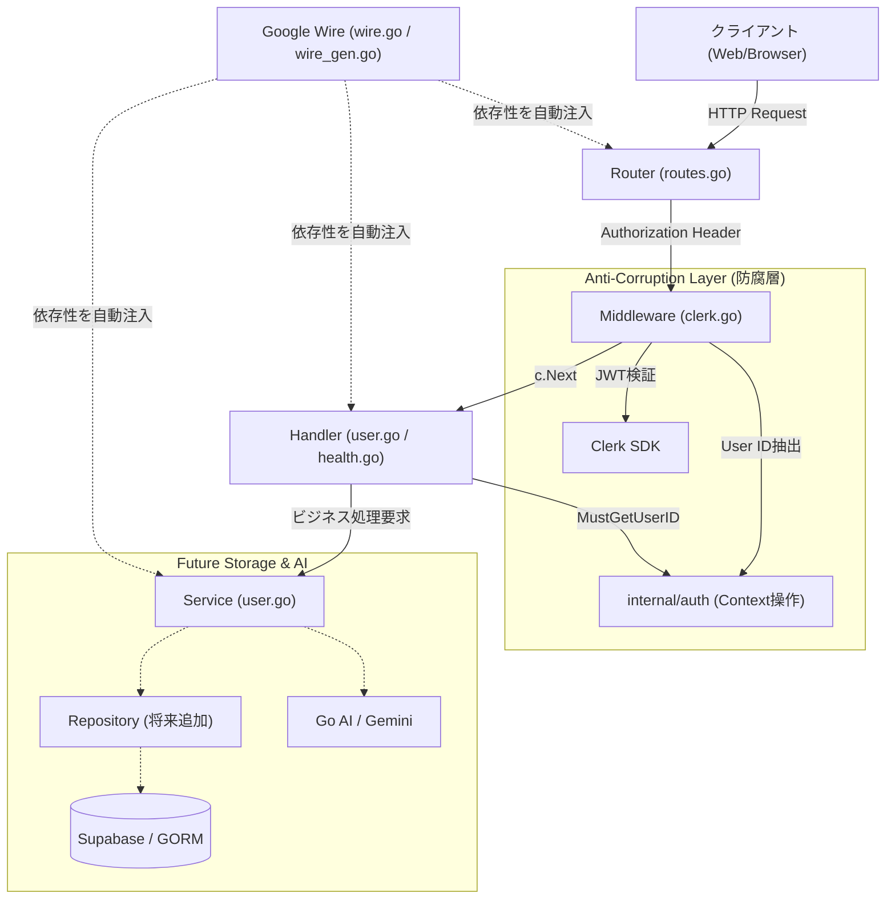
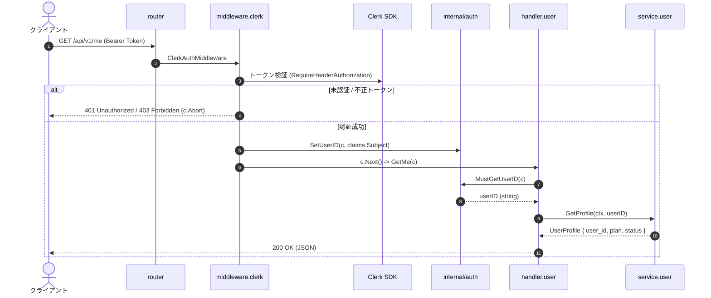

# Go + Gin + Clerk 認証 & AI チャット基盤 API

本プロジェクトは、**Go (Gin)** と **Clerk** による堅牢な認証基盤の上に、将来的な **GORM (Supabase)** および **Go AI (LLM)** を統合した「AI チャットアプリケーション」を見据えたバックエンド API サーバーです。

単なるプロトタイプにとどまらず、実務で耐えうる **「疎結合」「高テスタビリティ」「コンパイル時 DI（Google Wire）」** を備えたレイヤードアーキテクチャを採用しています。

---

## 目次

- [1. 技術スタック](#1-技術スタック)
- [2. システムアーキテクチャ & データフロー](#2-システムアーキテクチャ--データフロー)
- [3. ディレクトリ構成](#3-ディレクトリ構成)
- [4. これまでの設計判断と進化のプロセス（ADR）](#4-これまでの設計判断と進化のプロセスadr)
  - [4.1. Clerk SDK の依存をミドルウェアに隔離（防腐層の導入）](#41-clerk-sdk-の依存をミドルウェアに隔離防腐層の導入)
  - [4.2. Gin Context と `internal/auth` による型安全な認証受け渡し](#42-gin-context-と-internalauth-による型安全な認証受け渡し)
  - [4.3. Google Wire の導入（手動DIからの脱却）](#43-google-wire-の導入手動diからの脱却)
  - [4.4. Handler と Service の明確な責務分離](#44-handler-と-service-の明確な責務分離)
  - [4.5. Wire 定義ファイル名を `wire.go` に統一](#45-wire-定義ファイル名を-wirego-に統一)
- [5. 今後の運用・拡張構想（GORM + Supabase + GoAI）](#5-今後の運用拡張構想gorm--supabase--goai)
- [6. ローカル開発環境のセットアップ](#6-ローカル開発環境のセットアップ)

---

## 1. 技術スタック

| カテゴリ                 | 採用技術                                                 | バージョン / 用途                    |
| :----------------------- | :------------------------------------------------------- | :----------------------------------- |
| **Language**             | [Go](https://go.dev/)                                    | 1.25                                 |
| **Web Framework**        | [Gin](https://github.com/gin-gonic/gin)                  | v1.11.0 (高速な HTTP ルーティング)   |
| **Authentication**       | [Clerk Go SDK](https://github.com/clerk/clerk-sdk-go/v2) | v2.7.0 (JWT 検証・セッション管理)    |
| **Dependency Injection** | [Google Wire](https://github.com/google/wire)            | v0.7.0 (コンパイル時コード生成型 DI) |
| **Live Reload**          | [Air](https://github.com/air-verse/air)                  | v1.63.4 (コンテナ内ホットリロード)   |
| **Container**            | Docker / Docker Compose                                  | Alpine Linux ベースの開発環境        |
| **Future Extensions**    | GORM (PostgreSQL / Supabase)                             | DB アクセス & メッセージ履歴管理     |
|                          | Google Gen AI SDK (Go)                                   | AI チャット返答生成エンジン          |

---

## 2. システムアーキテクチャ & データフロー

### レイヤードアーキテクチャ

システムは関心の分離（Separation of Concerns）に基づき、以下の階層構造で構成されています。



### リクエスト処理シーケンス（`/api/v1/me` の例）



---

## 3. ディレクトリ構成

```
study-gin-clerk/
  ├── Dockerfile                    # Go 1.25 + Air + Wire CLI
  ├── compose.yaml                  # Docker Compose 定義
  ├── .air.toml                     # ホットリロード設定
  ├── wire-manual.md                # Google Wire 運用マニュアル
  ├── cmd/
  │    └── api/
  │         ├── main.go             # エントリポイント (InitializeApp の実行と HTTP サーバ起動)
  │         ├── wire.go             # Wire 設計図 (Injector 宣言)
  │         └── wire_gen.go         # Wire が自動生成した初期化コード
  ├── internal/
  │    ├── auth/
  │    │    └── user.go             # 認証コンテキスト操作 (SetUserID, MustGetUserID)
  │    ├── config/
  │    │    └── env.go              # 環境変数読み込み・バリデーション
  │    ├── handler/
  │    │    ├── wire.go             # handler.Set (Handler 層の DI 定義)
  │    │    ├── health.go           # ヘルスチェック API
  │    │    └── user.go             # ユーザー関連 API
  │    ├── middleware/
  │    │    └── clerk.go            # Clerk 認証ミドルウェア
  │    ├── router/
  │    │    ├── wire.go             # router.Set (Router 層の DI 定義)
  │    │    └── routes.go           # エンドポイントのルーティング定義
  │    └── service/
  │         ├── wire.go             # service.Set (Service 層の DI 定義)
  │         └── user.go             # ユーザー関連ビジネスロジック
  └── web/
       └── index.html               # 動作検証用フロントエンド (Clerk JS 連携)
```

---

## 4. これまでの設計判断と進化のプロセス（ADR）

本プロジェクトは初期の単純な実装から、設計上の議論を経て現在のアーキテクチャへと進化しました。その意思決定プロセスを記録します。

### 4.1. Clerk SDK の依存をミドルウェアに隔離（防腐層の導入）

- **初期の課題**:
  各ハンドラーが `github.com/clerk/clerk-sdk-go/v2` をインポートし、`clerk.SessionClaimsFromContext` を直接呼び出していた。この設計では、認証プロバイダのコードがアプリ全体に散らばり、将来の認証切り替えやハンドラーのテストが困難になっていた。
- **解決策**:
  Clerk SDK の呼び出しを [`internal/middleware/clerk.go`](file:///home/naomi/prog/test/study-gin-clerk/internal/middleware/clerk.go) の中に完全にカプセル化。認証通過時にユーザー ID（`claims.Subject`）を取り出し、アプリ内部のコンテキストに変換して流す「防腐層（Anti-Corruption Layer）」を構築した。
- **効果**:
  Handler や Service 層から外部認証ベンダーへの依存が完全に排除され、疎結合を実現。

### 4.2. Gin Context と `internal/auth` による型安全な認証受け渡し

- **議論のポイント**:
  「ミドルウェアで取れたなら、ハンドラーの引数に直接 `userID` を渡せないのか？」
- **背景と仕様制約**:
  Gin のルーターシグネチャは `func(*gin.Context)` で固定されているため、引数追加は不可。値の受け渡しはコンテキスト経由（`c.Set` / `c.Get`）で行う必要がある。
- **解決策**:
  文字列キー（`"user_id"`）のタイポや `any` からの型キャスト失敗を防ぐため、専用の [`internal/auth`](file:///home/naomi/prog/test/study-gin-clerk/internal/auth/user.go) パッケージを定義。
  - `auth.SetUserID(c, userID)`
  - `auth.MustGetUserID(c)`
    ハンドラー側では未認証チェックの二重分岐を書く必要がなくなり、1行で安全に取得可能とした。

### 4.3. Google Wire の導入（手動DIからの脱却）

- **将来課題の予見**:
  将来「GORM（DB）」や「Go AI」が追加された際、`main.go` での依存関係組み立て（手動 DI）がパズル状態になり、`main.go` が肥大化するリスクがあった。
- **解決策**:
  Google 公式のコンパイル時 DI ツール **Google Wire** を初期段階で導入。
  - リフレクションを使わないため実行時パフォーマンスオーバーヘッドがゼロ。
  - 依存解決の失敗はビルド前に検知可能。
  - `main.go` は `InitializeApp()` を呼ぶだけのシンプルな状態を維持できる。

### 4.4. Handler と Service の明確な責務分離

- **理由と役割**:
  - **Handler**: Web（HTTP / Gin）の通訳係。JSON のバインド、ステータスコードの返却、HTTP ヘッダーの処理に専念する。
  - **Service**: 純粋な業務ルール（ビジネスロジック）の実行係。Gin には一切依存せず、標準の `context.Context` とプリミティブ型で動作する。
- **効果**:
  将来「会話履歴の取得 → 利用制限判定 → AI プロンプト生成 → 返答保存」という一連の AI チャット業務フローを実装する際、Web 通信の都合と業務ルールが混ざらず、単体テストが極めて書きやすい構造となった。

### 4.5. Wire 定義ファイル名を `wire.go` に統一

- **可読性の向上**:
  各パッケージ内に `wire.go` を配置（`handler/wire.go`, `service/wire.go`, `router/wire.go`）。「Wire への登録情報は各フォルダの `wire.go` を見ればすべて分かる」という統一ルールを確立した。

---

## 5. 今後の運用・拡張構想（GORM + Supabase + GoAI）

本番の「AIチャットアプリ」へ向けた拡張ロードマップです。

```
[クライアント]
      │ POST /api/v1/chat/messages
      ▼
[ChatHandler]  (JSONパース & userID取得)
      │ SendMessage(ctx, userID, message)
      ▼
[ChatService]  (業務フローの統括)
      ├──> [RateLimiter]       (送信上限チェック)
      ├──> [ChatRepository]    (過去履歴を Supabase / GORM から取得)
      ├──> [Go AI Client]      (Gemini / OpenAI にプロンプト送信)
      └──> [ChatRepository]    (ユーザー発話 & AI応答を DB に永続化)
```

### 拡張ステップ

1. **インフラ層の追加 (`internal/infra`)**:
   - GORM による Supabase PostgreSQL への接続 Provider（`NewGormDB`）
   - Go AI クライアントの初期化 Provider（`NewAIClient`）
2. **Repository 層の追加 (`internal/repository`)**:
   - `ChatRepository`（会話セッション・メッセージの保存・取得）
3. **Service 層の拡張 (`internal/service`)**:
   - `ChatService`（履歴付きチャット生成のオーケストレーション）
4. **Wire による自動結合**:
   - 新しいパッケージの `wire.go` を `cmd/api/wire.go` に追加し、`wire gen` を実行するだけで全自動配線。

詳しい追加手順は [`wire-manual.md`](file:///home/naomi/prog/test/study-gin-clerk/wire-manual.md) を参照してください。

---

## 6. ローカル開発環境のセットアップ

### 前提条件

- Docker & Docker Compose がインストールされていること
- [Clerk](https://clerk.com/) のアカウントおよび API キーがあること

### 1. 環境変数の準備

プロジェクト直下に `.env` を作成します。

```env
PORT=8080
CLERK_SECRET_KEY=sk_test_xxxxxxxxxxxxxxxxxxxxx
```

※ フロントエンドテスト用（`web/index.html`）の Publishable Key は、必要に応じて `web/index.html` 内の `publishableKey` に設定してください。

### 2. コンテナのビルドと起動

```bash
docker compose up --build
```

- Air によるホットリロードが有効化されています。ファイルを保存すると自動で再ビルド・再起動されます。

### 3. Wire コードの再生成（開発時）

ハンドラーやサービスのコンストラクタを変更・追加した場合は、コンテナ内で以下を実行します：

```bash
docker compose exec api wire gen ./cmd/api
```

### 4. 動作確認

- **Web UI (Clerk ログイン & トークン取得)**: `http://localhost:8080/`
- **Health Check**: `curl http://localhost:8080/health`
  ```json
  { "status": "ok" }
  ```
- **Me API (認証必須)**:
  ```bash
  curl -H "Authorization: Bearer <YOUR_JWT_TOKEN>" http://localhost:8080/api/v1/me
  ```
  ```json
  {
    "user_id": "user_xxxxxxxx",
    "plan": "free",
    "status": "active"
  }
  ```
